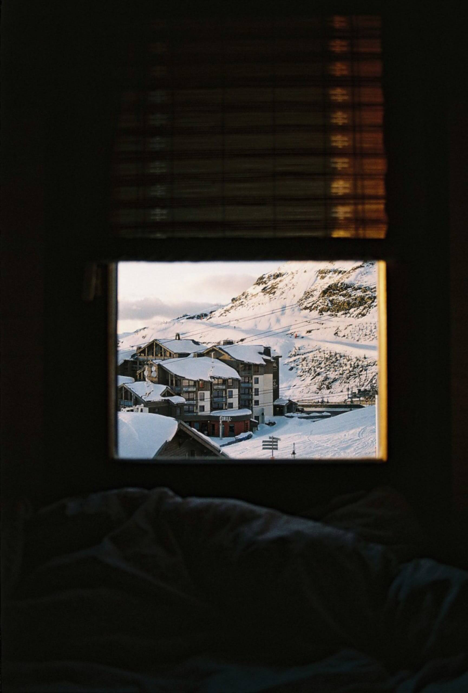

# Project 3: Spots

### Overview  

* Intro  
* Figma
* Tech Stack  
* Images
* Deployment
  
**Intro**
  
This project is made so all the elements are displayed correctly on popular screen sizes. This is an image sharing site with the ability to like images. There is also the ability to like images, edit your profile, and add new posts.
**Figma**  
  
* [Link to the project on Figma](https://www.figma.com/file/BBNm2bC3lj8QQMHlnqRsga/Sprint-3-Project-%E2%80%94-Spots?type=design&node-id=2%3A60&mode=design&t=afgNFybdorZO6cQo-1)

**Tech Stack**
*HTML
*CSS
*Responsive Design
  
**Images**  
  

**Deployment**
  This webpage is deployed to GitHub pages
  [deployment link](https://aleksc3.github.io/se_project_spots/)

